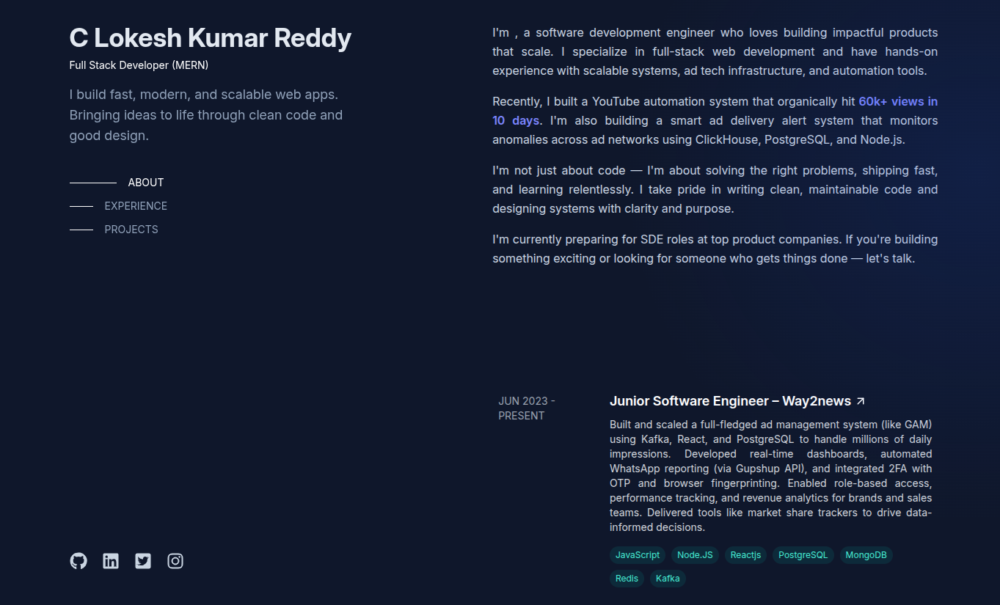

# ⚡ DevPortfolio – React & Tailwind Developer Portfolio

A clean, fast, and fully customizable developer portfolio built using **React** and **Tailwind CSS** — designed to showcase your skills, experience, and projects professionally.

> 🔗 **Live Preview**: [https://www.lokeshkrportfolio.com/](https://www.lokeshkrportfolio.com/)

---

## ✨ Features

- 🚀 Built with **React** + **Tailwind CSS**
- 🎯 Fully **responsive** and **mobile-friendly**
- ⚡ **Fast performance** and optimized build with Vite
- 📄 Resume-style layout with **About**, **Skills**, **Experience**, **Projects**, **Certifications** and **Contact**
- 🧩 Just update a data file — no backend needed
- 🆓 **MIT licensed**, open to use and modify

---

## 📸 Preview



---

## 🛠️ Tech Stack

- [React](https://reactjs.org/)
- [Tailwind CSS](https://tailwindcss.com/)
- [Vite](https://vitejs.dev/)
- [ReactIcons](https://react-icons.github.io/react-icons/)

---

## 📦 Getting Started

### 1. Clone the Repository

```bash
git clone https://github.com/Lokesh396/Portfolio.git
cd Portfolio
npm install
npm run dev
```

##### Update the data.js file inside the utils folder.

---

## 🙏 Credits

This project is **inspired by** [Brittany Chiang’s portfolio](https://brittanychiang.com/), one of the most iconic open-source developer portfolios.

> All design credit goes to **Brittany Chiang** — thank you for making your work open-source and inspiring developers around the world. 🙌

---

## 🧑‍💻 Author

**C Lokesh Kumar Reddy**  
[LinkedIn](https://www.linkedin.com/in/c-lokesh-kumar-reddy-30a5681a1/)  
[GitHub](https://github.com/Lokesh396)
